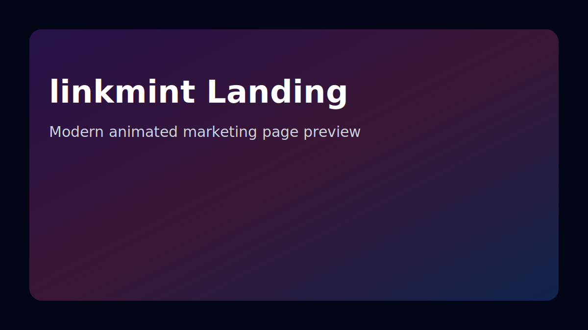
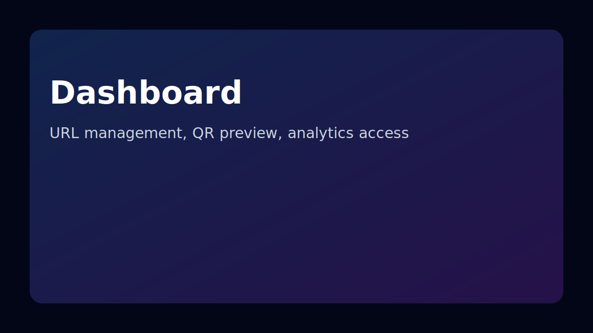
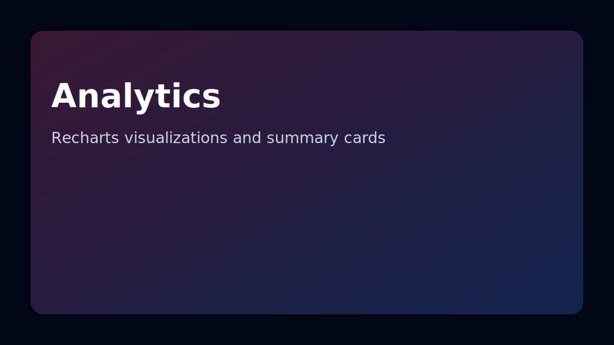

# linkvio

Production-ready URL shortener monorepo.

## Stack

- Backend: Node.js, Fastify, PostgreSQL, Redis, Prisma
- Frontend: React, Vite, TailwindCSS, Framer Motion, GSAP, ShadCN-style UI, Lucide, Recharts
- Deployment: Docker, Fly.io

## Monorepo Layout

- `backend/`
- `frontend/`
- `docker/`
- `scripts/`

## Quick Start (Single Command)

```bash
npm run up
```

Local URLs:
- Frontend: http://localhost:5173
- Backend API: http://localhost:3000
- Health: http://localhost:3000/health

Optional detached mode that prints URLs:

```bash
npm run up:detached
```

## Optional Local Node Dev

```bash
npm install
copy backend/.env.example backend/.env
copy frontend/.env.example frontend/.env
npm run dev
```

## Default Seed Admin

- email: `admin@linkvio`
- password: `admin123`
- role: `GAdmin`

Seed runs during backend container startup.

## Core Features

- Custom alias allowed (`[a-zA-Z0-9]`, length 1+)
- Auto-generated 6-character Base62 alias when omitted
- Alias conflict returns 4 suggestions with 4-8 chars
- Redis redirect cache (`short_code -> long_url`)
- 301 redirect with click tracking
- Access token JWT auth (`10m`)
- Refresh token in `httpOnly` secure cookie (`7d`, `sameSite=strict`)
- API key validation (`X-API-Key`)
- Origin validation
- Rate limit: 10 URL creation requests per user/minute
- Role-based access (`guest`, `user`, `admin`, `GAdmin`)
- Email OTP authentication (6-digit OTP in Redis, TTL 5 minutes)
- Google OAuth login
- Helmet security headers
- Admin HMAC request-signature verification

## Database Schema

### `users`
- id
- email
- password_hash
- role
- api_key
- created_at

### `urls`
- id
- short_code
- long_url
- created_by
- created_from
- created_ip
- created_at

### `clicks`
- id
- url_id
- ip
- country
- referrer
- clicked_at

## API

### Auth

#### Request OTP
`POST /api/auth/request-otp`

```bash
curl -X POST http://localhost:3000/api/auth/request-otp \
  -H "Content-Type: application/json" \
  -d '{"email":"user@example.com"}'
```

#### Verify OTP (Login/Signup via email OTP)
`POST /api/auth/verify-otp`

```bash
curl -X POST http://localhost:3000/api/auth/verify-otp \
  -H "Content-Type: application/json" \
  -d '{"email":"user@example.com","otp":"123456","mode":"login"}'
```

#### Google Login
`POST /api/auth/google`

```bash
curl -X POST http://localhost:3000/api/auth/google \
  -H "Content-Type: application/json" \
  -d '{"id_token":"<GOOGLE_ID_TOKEN>"}'
```

#### Refresh Session
`POST /api/refresh`

Uses `refresh_token` cookie and returns a new access token.

#### Admin Password Login
`POST /api/login`

Special GAdmin assignment credentials:
- email: `giridharans1729@gmail.com`
- password: `Giri@2005`

```bash
curl -X POST http://localhost:3000/api/login \
  -H "Content-Type: application/json" \
  -d '{"email":"giridharans1729@gmail.com","password":"Giri@2005"}'
```

### URL Creation

#### Guest URL Create
`POST /api/url`

```bash
curl -X POST http://localhost:3000/api/url \
  -H "Content-Type: application/json" \
  -d '{"long_url":"https://example.com"}'
```

#### Authenticated URL Create (JWT + API key)
`POST /api/url`

```bash
curl -X POST http://localhost:3000/api/url \
  -H "Authorization: Bearer <JWT>" \
  -H "X-API-Key: <API_KEY>" \
  -H "Origin: http://localhost:5173" \
  -H "Content-Type: application/json" \
  -d '{"long_url":"https://example.com","custom_alias":"giri"}'
```

### Redirect

`GET /:code`

```bash
curl -i http://localhost:3000/giri
```

### User CRUD APIs

- `POST /api/url`
- `GET /api/myurls`
- `PUT /api/url/:id`
- `DELETE /api/url/:id`
- `GET /api/url/:id/analytics`

### Admin APIs

Requires:
- JWT of `GAdmin`
- `X-API-Key`
- `X-Timestamp` (unix ms)
- `X-Admin-Signature`

Endpoints:
- `GET /api/all`
- `GET /api/users`

Signature formula:

`signature = HMAC_SHA256(timestamp + request_path, ADMIN_PRIVATE_KEY)`

Rejected when:
- timestamp older than 60 seconds
- signature mismatch

Frontend computes this automatically for `/api/all` and `/api/users` when `VITE_ADMIN_PRIVATE_KEY` is configured.

## Frontend Pages

- `/` premium animated marketing landing page + hero shortener
- auth uses full-screen modal from navbar login action
- `/dashboard` SaaS layout with create widget, QR preview, search, pagination
- `/analytics` charts (clicks over time, top referrers, top countries)
- `/api-key` API key view/copy/regenerate UI
- `/settings` protected settings page
- `/all` admin users/URLs/global analytics

## Auth Environment

Backend (`backend/.env`):
- `ACCESS_TOKEN_EXPIRES_IN=10m`
- `REFRESH_TOKEN_EXPIRES_IN=7d`
- `COOKIE_SECURE=false` (set `true` in production HTTPS)
- `ADMIN_PRIVATE_KEY=...`
- `GOOGLE_CLIENT_ID=...`
- `SMTP_*` values for OTP email delivery

Frontend (`frontend/.env`):
- `VITE_GOOGLE_CLIENT_ID=...`
- `VITE_ADMIN_PRIVATE_KEY=...` (must match backend `ADMIN_PRIVATE_KEY`)

## Frontend UI Highlights

- Sticky glass navbar with animated mobile menu
- Hero with animated gradient and floating particles
- GSAP ScrollTrigger reveal effects and hero animation
- Framer Motion page transitions
- Gradient separators and glassmorphism cards
- Responsive desktop/tablet/mobile layouts
- Accessible labels and keyboard-focus styles
- Code splitting + lazy loading for heavy landing sections

## Screenshots

Landing:



Dashboard:



Analytics:



## Fly.io Deployment

Prerequisite: install Fly CLI and login.

```bash
cd scripts
pwsh ./deploy-fly.ps1 -BackendApp linkvio-backend -FrontendApp linkvio-frontend
```

Manual commands used by the script:

```bash
fly launch
fly deploy
```

Use `fly.backend.toml` and `fly.frontend.toml` to customize app names/regions/ports.

## Useful Scripts

From repository root:

- `npm run dev`
- `npm run up`
- `npm run up:detached`
- `npm run docker:up`
- `npm run docker:down`
- `npm run prisma:migrate`
- `npm run seed`
